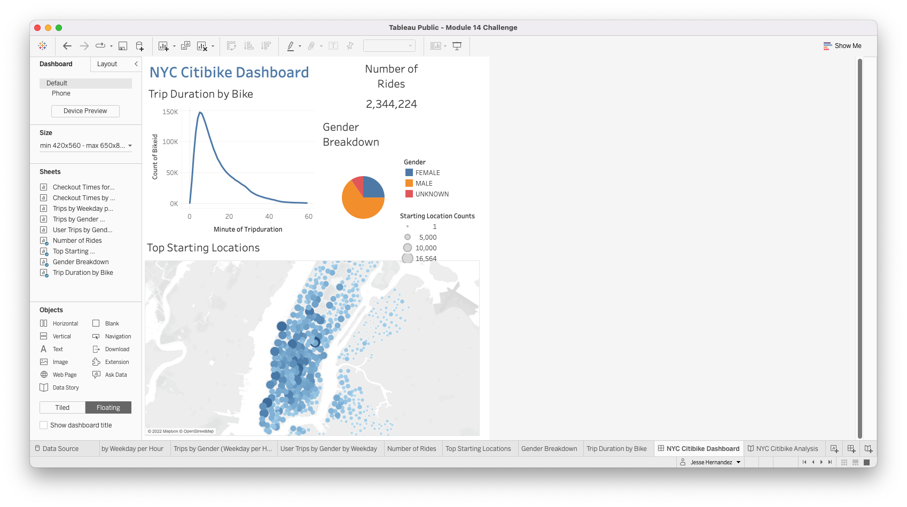
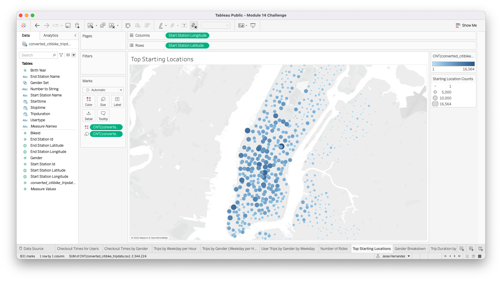
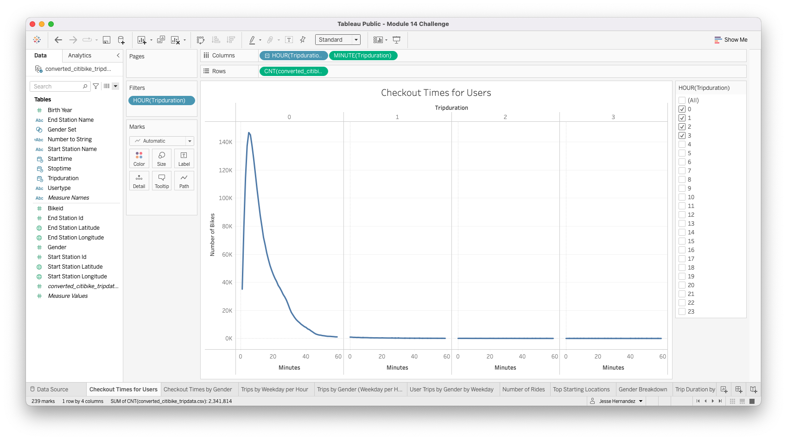
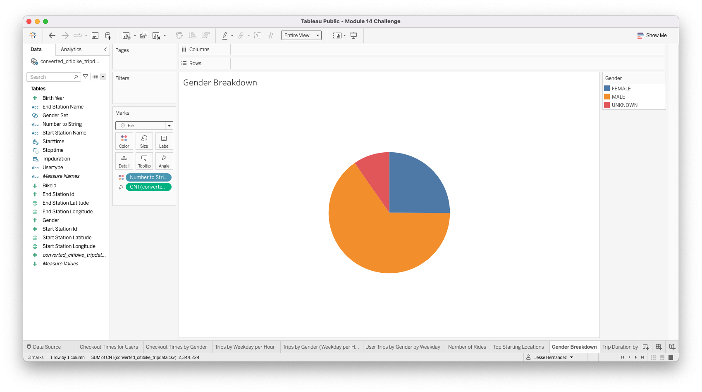
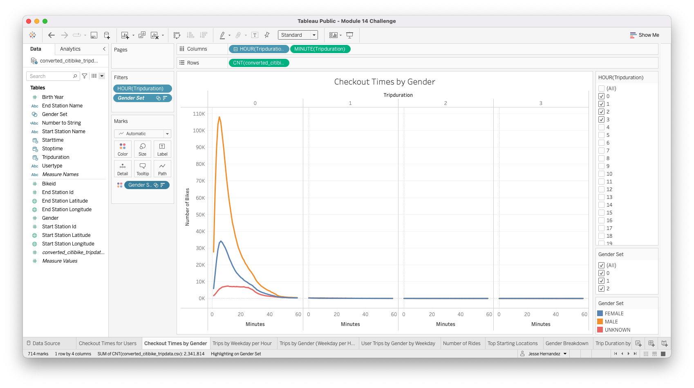
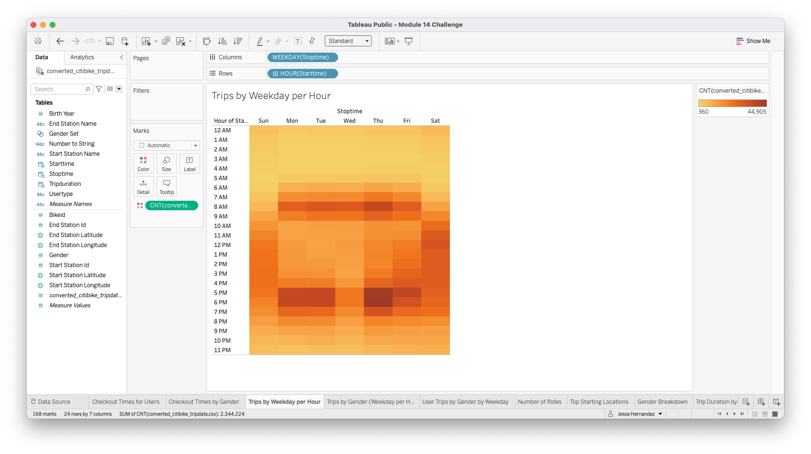
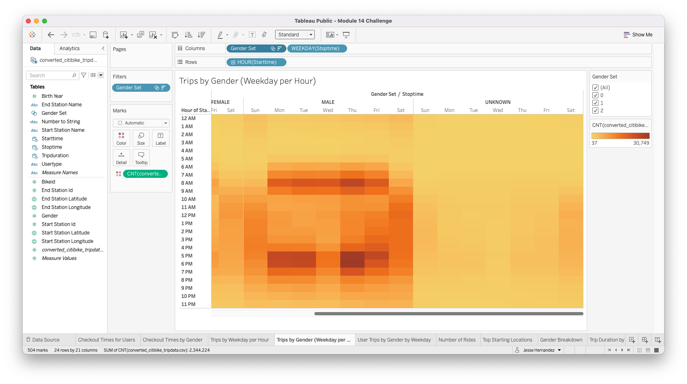
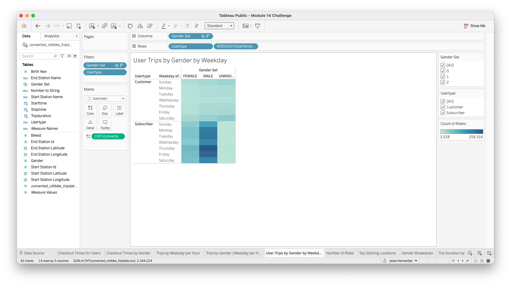

# bikesharing
Tableau

## Overview
The purpose for this project is to put together a presentation to convince prospective
investors into investing in a bike-sharing program in Des Moines, IA with a solid business
proposal.
We will do this by providing analysis trip data collected from Citibike in NYC. We have
provided visualizations below that support our proposal that show total number of ridership,
location data, tripdata duration, ridership types (Subscribers, customers), and breakdowns
by gender.

## Results
This is an overview of our NYC Citibike analysis that highlights Trip Duration by 
Bike, Number of total rides in August, Gender breakdown and Top Starting locations.

This map shows our top starting points of where riders begin a ride

Of the 2.3 million rides total in the month of Aug 2019, most rides had a duration ~5min

The gender breakdown shows that most riders are male

We can see the checkout durations are similar between Male, Female with trip durations
being around ~5min. But, the Unknown catagory seem to have trip durations ~ 15-20min

Our analysis shows that most trips are taken during the work week. With Mon, Tues and Thur 
being the heaviest during the "commuter" hours between 7-9am and 5-7pm.
We also see a steady ridership on Saturdays for most of the day.

The ridership shows relatively the same pattern when broken down by gender

Most of the riders show to be subscribers to Citibike with Males being the dominant subscriber

## Summary
In summary, the data shows that we could have a high total volume of ridership with
peak trips during the work week to service commuters in the city. We can also expect
a steady number of ridership during the weekends for the majority part of the day, not
just the commuter hours. Lastly, we could expect most of our riders to be subcribers to the
service.